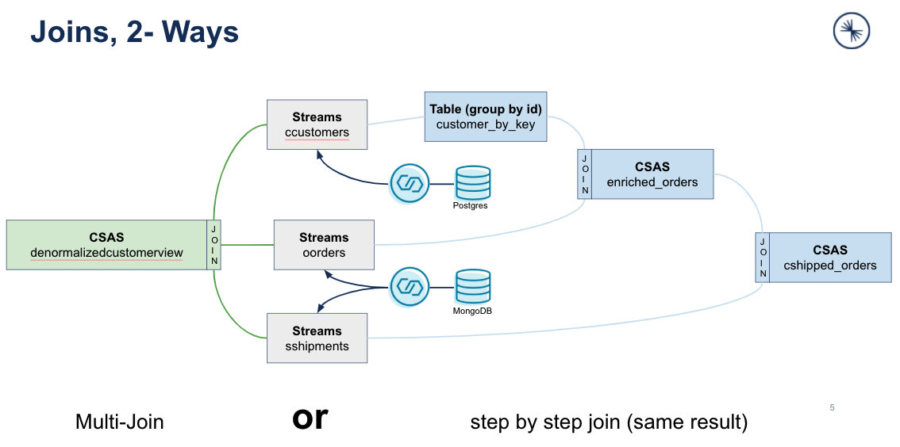

# De-normalize a customer object with ksqlDB
We prepared two demos where we de-normalized so to say database tables into Confluent Platform kafka. The use case behind this is to do preprocessing events directly in the Kafka cluster and not in the target system. Jay kreps named this architecture pattern Kappa-Architecture.

## Demo 1: de-normalize customer tables in Confluent Kafka cluster
This sample is quite complex and do a couple of joins and then a much more simplified method with a multi-join. The use case behind, is to ETL data from databases (mongoDB and postGRES) and transform the data into de-normalized object. Which me move to Elastic-Search later.


Create the customers table in Postgres DB and insert 3 customers:
```bash
docker exec -it postgres /bin/bash
psql -U postgres-user customers
customers=# CREATE TABLE customers (id TEXT PRIMARY KEY, name TEXT, age INT);
customers=# INSERT INTO customers (id, name, age) VALUES ('5', 'fred', 34);
customers=# INSERT INTO customers (id, name, age) VALUES ('7', 'sue', 25);
customers=# INSERT INTO customers (id, name, age) VALUES ('2', 'bill', 51);
customers=# exit
exit
```
Prepare the data in MongoDB and insert data into orders and shipments:
```bash
docker exec -it mongo /bin/bash
mongo -u $MONGO_INITDB_ROOT_USERNAME -p mongo-pw admin
> rs.initiate()
my-replica-set:SECONDARY> use config
my-replica-set:SECONDARY> db.createRole({
    role: "dbz-role",
    privileges: [
        {
            resource: { db: "config", collection: "system.sessions" },
            actions: [ "find", "update", "insert", "remove" ]
        }
    ],
    roles: [
       { role: "dbOwner", db: "config" },
       { role: "dbAdmin", db: "config" },
       { role: "readWrite", db: "config" }
    ]
})
my-replica-set:PRIMARY> use admin
my-replica-set:PRIMARY> db.createUser({
  "user" : "dbz-user",
  "pwd": "dbz-pw",
  "roles" : [
    {
      "role" : "root",
      "db" : "admin"
    },
    {
      "role" : "readWrite",
      "db" : "logistics"
    },
    {
      "role" : "dbz-role",
      "db" : "config"
    }
  ]
})
# Create the logistics collections in MongoDB
my-replica-set:PRIMARY> use logistics
my-replica-set:PRIMARY> db.createCollection("orders")
my-replica-set:PRIMARY> db.createCollection("shipments")
my-replica-set:PRIMARY> db.orders.insert({"customer_id": "2", "order_id": "13", "price": 50.50, "currency": "usd", "ts": "2021-03-23T11:20:00"})
my-replica-set:PRIMARY> db.orders.insert({"customer_id": "2", "order_id": "13", "price": 50.50, "currency": "usd", "ts": "2021-03-23T11:20:00"})
my-replica-set:PRIMARY> db.orders.insert({"customer_id": "5", "order_id": "15", "price": 13.75, "currency": "usd", "ts": "2021-03-23T02:55:00"})
my-replica-set:PRIMARY> db.orders.insert({"customer_id": "7", "order_id": "22", "price": 29.71, "currency": "aud", "ts": "2021-03-23T00:12:00"})
my-replica-set:PRIMARY> db.shipments.insert({"order_id": "17", "shipment_id": "75", "origin": "texas", "ts": "2021-03-23T19:20:00"})
my-replica-set:PRIMARY> db.shipments.insert({"order_id": "22", "shipment_id": "71", "origin": "iowa", "ts": "2021-03-23T12:25:00"})
my-replica-set:PRIMARY> db.shipments.insert({"order_id": "29", "shipment_id": "89", "origin": "california", "ts": "2021-03-23T13:21:00"})
my-replica-set:PRIMARY> db.shipments.insert({"order_id": "13", "shipment_id": "92", "origin": "maine", "ts": "2021-03-23T06:13:00"})
my-replica-set:PRIMARY> db.shipments.insert({"order_id": "15", "shipment_id": "95", "origin": "florida", "ts": "2021-03-23T01:13:00"})
my-replica-set:PRIMARY> exit
exit
```
Start the Postgres and MongoDB Debezium source connectors. We use the ksqlDB cli for this but you could also use the Confluent Control Center.
```bash
docker exec -it workshop-ksqldb-cli ksql http://ksqldb-server:8088
ksql> SET 'auto.offset.reset' = 'earliest';
ksql> CREATE SOURCE CONNECTOR customers_reader WITH (
    'connector.class' = 'io.debezium.connector.postgresql.PostgresConnector',
    'database.hostname' = 'postgres',
    'database.port' = '5432',
    'database.user' = 'postgres-user',
    'database.password' = 'postgres-pw',
    'database.dbname' = 'customers',
    'database.server.name' = 'customers',
    'table.whitelist' = 'public.customers',
    'transforms' = 'unwrap',
    'transforms.unwrap.type' = 'io.debezium.transforms.ExtractNewRecordState',
    'transforms.unwrap.drop.tombstones' = 'false',
    'transforms.unwrap.delete.handling.mode' = 'rewrite'
);
ksql> CREATE SOURCE CONNECTOR logistics_reader WITH (
    'connector.class' = 'io.debezium.connector.mongodb.MongoDbConnector',
    'mongodb.hosts' = 'mongo:27017',
    'mongodb.name' = 'my-replica-set',
    'mongodb.authsource' = 'admin',
    'mongodb.user' = 'dbz-user',
    'mongodb.password' = 'dbz-pw',
    'collection.whitelist' = 'logistics.*',
    'transforms' = 'unwrap',
    'transforms.unwrap.type' = 'io.debezium.connector.mongodb.transforms.ExtractNewDocumentState',
    'transforms.unwrap.drop.tombstones' = 'false',
    'transforms.unwrap.delete.handling.mode' = 'drop',
    'transforms.unwrap.operation.header' = 'true'
);
```
The connectors created topics and sync the data from databases into topics. To do preprocessing in Kafka we need to create the ksqlDB source streams first. You can do this in cli or Confluent Control Center.
```bash
ksql> SET 'auto.offset.reset' = 'earliest';
ksql> CREATE STREAM ccustomers WITH (
    kafka_topic = 'customers.public.customers',
    value_format = 'avro');
ksql> CREATE STREAM oorders WITH (
    kafka_topic = 'my-replica-set.logistics.orders',
    value_format = 'avro',
    timestamp = 'ts',
    timestamp_format = 'yyyy-MM-dd''T''HH:mm:ss');
ksql> CREATE STREAM sshipments WITH (
    kafka_topic = 'my-replica-set.logistics.shipments',
    value_format = 'avro',
    timestamp = 'ts',
    timestamp_format = 'yyyy-MM-dd''T''HH:mm:ss');
# Join the streams together
ksql> CREATE TABLE customers_by_key AS
    SELECT id,
           latest_by_offset(name) AS name,
           latest_by_offset(age) AS age
    FROM ccustomers
    GROUP BY id
    EMIT CHANGES;
# for this table a pull query should now work
ksql> select * from customers_by_key where id = '5';
# Create complete joined object    
ksql> CREATE STREAM enriched_orders AS
    SELECT o.order_id,
           o.price,
           o.currency,
           o.customer_id,
           c.id AS cid,
           c.name AS customer_name,
           c.age AS customer_age
    FROM oorders AS o
    LEFT JOIN customers_by_key c
    ON o.customer_id = c.id
    EMIT CHANGES;
ksql> select * from enriched_orders emit changes;
ksql> CREATE STREAM cshipped_orders WITH (
    kafka_topic = 'cshipped_orders'
)   AS
    SELECT o.order_id,
           s.shipment_id,
           o.customer_id,
           o.customer_name,
           o.customer_age,
           s.origin,
           o.price,
           o.currency
    FROM enriched_orders AS o
    INNER JOIN sshipments s
    WITHIN 7 DAYS
    ON s.order_id = o.order_id
    EMIT CHANGES;
ksql> select * from cshipped_orders emit changes;
```
So, what we did is to combine all data we need into one object. The flow for this setup looks like this


Start the Elasticsearch sink connector
```bash
ksql> CREATE SINK CONNECTOR enriched_writer WITH (
    'connector.class' = 'io.confluent.connect.elasticsearch.ElasticsearchSinkConnector',
    'connection.url' = 'http://elastic:9200',
    'type.name' = 'kafka-connect',
    'topics' = 'cshipped_orders'
);
ksql> exit;
```
Check that the data arrived in the Elasticsearch index by running the following command from your host::
```bash
curl http://localhost:9200/cshipped_orders/_search?pretty
```
Creating a de-normalized customer object
```bash
docker exec -it workshop-ksqldb-cli ksql http://ksqldb-server:8088
ksql> describe ccustomers;
ksql> describe customers_by_key;
ksql> describe OORDERS;
ksql> describe SSHIPMENTS;
ksql> SET 'auto.offset.reset' = 'earliest';
# get customer view
ksql> SELECT o.order_id as ORDER_ID,
       c.id AS c_id,
       c.name AS customer_name,
       c.age AS customer_age,
       o.customer_id,
       o.price,
       o.currency,
       s.shipment_id,
       s.origin
    FROM oorders AS o
    JOIN customers_by_key c ON o.customer_id = c.id
    JOIN sshipments s WITHIN 7 DAYS ON s.order_id = o.order_id
    EMIT CHANGES;
```

Open a second terminal and insert new data into the databases
Insert new customers in Postgres
```bash
docker exec -it postgres /bin/bash
psql -U postgres-user customers
customers=# INSERT INTO customers (id, name, age) VALUES ('10', 'carsten', 54);
customers=# INSERT INTO customers (id, name, age) VALUES ('15', 'suvad', 45);
customers=# INSERT INTO customers (id, name, age) VALUES ('20', 'jan', 43);
customers=# exit
exit
```
Configure MongoDB for Debezium and insert data for orders and shipments:
```bash
docker exec -it mongo /bin/bash
mongo -u $MONGO_INITDB_ROOT_USERNAME -p mongo-pw admin
my-replica-set:PRIMARY> use logistics
my-replica-set:PRIMARY> db.orders.insert({"customer_id": "10", "order_id": "113", "price": 50.50, "currency": "eur", "ts": "2021-03-23T11:20:00"})
my-replica-set:PRIMARY> db.orders.insert({"customer_id": "15", "order_id": "117", "price": 25.25, "currency": "eur", "ts": "2021-03-23T17:22:00"})
my-replica-set:PRIMARY> db.orders.insert({"customer_id": "20", "order_id": "115", "price": 13.75, "currency": "eur", "ts": "2021-03-23T02:55:00"})
my-replica-set:PRIMARY> db.shipments.insert({"order_id": "117", "shipment_id": "175", "origin": "Berlin", "ts": "2021-03-23T19:20:00"})
my-replica-set:PRIMARY> db.shipments.insert({"order_id": "113", "shipment_id": "192", "origin": "Falkensee", "ts": "2021-03-23T06:13:00"})
my-replica-set:PRIMARY> db.shipments.insert({"order_id": "115", "shipment_id": "195", "origin": "Munich", "ts": "2021-03-23T01:13:00"})
my-replica-set:PRIMARY> exit
exit
```
Open a third terminal and create a stream from query as persistant query   
```bash
docker exec -it workshop-ksqldb-cli ksql http://ksqldb-server:8088   
ksql> SET 'auto.offset.reset' = 'earliest'; 
ksql> CREATE STREAM denormalizedcustomerview AS
SELECT o.order_id as ORDER_ID,
       c.id AS c_id,
       c.name AS customer_name,
       c.age AS customer_age,
       o.customer_id,
       o.price,
       o.currency,
       s.shipment_id,
       s.origin
    FROM oorders AS o
    JOIN customers_by_key c ON o.customer_id = c.id
    JOIN sshipments s WITHIN 7 DAYS ON s.order_id = o.order_id
    EMIT CHANGES;
ksql> describe denormalizedcustomerview;
ksql> SET 'commit.interval.ms'= '1000';
ksql> select * from denormalizedcustomerview emit changes;
```
This experiment looks like this, a full view of the customer object including orders and shipment:
[

Now, exit from all terminals.

## Demo 2: de-normalize customer data of orders in Apache Kafka and create a complete Customer Order Report

Another sample should make it more viewable how easy it is to de-normalize a customer object. We would like to create a customer order report.

First create topics:
```bash
docker exec -it workshop-kafka  kafka-topics --create --topic custcustomers --bootstrap-server localhost:9092
docker exec -it workshop-kafka  kafka-topics --create --topic custorders --bootstrap-server localhost:9092
docker exec -it workshop-kafka  kafka-topics --create --topic custitems --bootstrap-server localhost:9092
```
Will will execute all command in Control Center. Please open [Confluent Control Center](http://localhost:9021)

```bash
docker exec -it workshop-ksqldb-cli ksql http://ksqldb-server:8088
ksql> SET 'auto.offset.reset' = 'earliest';
ksql> CREATE TABLE custcustomers (customerid STRING PRIMARY KEY, customername STRING) WITH (KAFKA_TOPIC='custcustomers', VALUE_FORMAT='json'); 
ksql> describe custcustomers;
ksql> CREATE STREAM custorders (orderid STRING KEY, customerid STRING, itemid STRING, purchasedate STRING) WITH (KAFKA_TOPIC='custorders', VALUE_FORMAT='json');
ksql> describe custorders;
ksql> CREATE TABLE custitems (itemid STRING PRIMARY KEY, itemname STRING) WITH (KAFKA_TOPIC='custitems', VALUE_FORMAT='json');
ksql> describe custitems;
ksql> INSERT INTO custcustomers (customerid , customername) VALUES ('1','Carsten Muetzlitz');
 INSERT INTO custcustomers (customerid , customername) VALUES ('2','Jan Svoboda');
 INSERT INTO custcustomers (customerid , customername) VALUES ('3','Suvad Sahovic');
ksql> select * from custcustomers emit changes limit 3;
ksql> INSERT INTO custitems (itemid , itemname ) VALUES ('1','MacBook Air');
INSERT INTO custitems (itemid , itemname ) VALUES ('2','Apple Pencil');
INSERT INTO custitems (itemid , itemname ) VALUES ('3','iPad Pro');
INSERT INTO custitems (itemid , itemname ) VALUES ('4','Apple Watch');
INSERT INTO custitems (itemid , itemname ) VALUES ('5','iPhone 12');
INSERT INTO custitems (itemid , itemname ) VALUES ('6','Apple TV');
ksql> select * from custitems emit changes limit 6;
ksql> INSERT INTO custorders (orderid, customerid , itemid , purchasedate ) VALUES ('1','1','1','2021-03-23');
INSERT INTO custorders (orderid, customerid , itemid , purchasedate ) VALUES ('2','1','2','2021-03-23');
INSERT INTO custorders (orderid, customerid , itemid , purchasedate ) VALUES ('3','3','3','2021-03-23');
INSERT INTO custorders (orderid, customerid , itemid , purchasedate ) VALUES ('4','3','4','2021-03-23');
INSERT INTO custorders (orderid, customerid , itemid , purchasedate ) VALUES ('5','2','5','2021-03-23');
INSERT INTO custorders (orderid, customerid , itemid , purchasedate ) VALUES ('6','2','6','2021-03-23');
KSQL> select * from custorders emit changes limit 6;
```
Let's join everything together. With ksqlDB lower 0.9 you need to go the old way.
```bash
ksql> CREATE STREAM tmp_join AS
SELECT c.customerid AS customerid, c.customername, o.orderid, o.itemid, o.purchasedate
FROM custorders as o
INNER JOIN custcustomers as c ON o.customerid = c.customerid
EMIT CHANGES;
ksql> CREATE STREAM customers_orders_report_old_way AS
SELECT t.customerid, t.customername, t.orderid, t.itemid, i.itemname, t.purchasedate
FROM tmp_join as t
LEFT JOIN custitems as i ON t.itemid = i.itemid
EMIT CHANGES;
ksql> select * from customers_orders_report_old_way emit changes;
```
I would say the old way is more complex and cost more resources. With ksqlDB >= 0.9 you can do multi-join. This is much more easier and generate less costs in terms of resource usage.
```bash
ksql> CREATE STREAM customers_orders_report AS
SELECT c.customerid AS customerid, c.customername, o.orderid, i.itemid, i.itemname, o.purchasedate
FROM custorders as o
LEFT JOIN custcustomers as c ON o.customerid = c.customerid
LEFT JOIN custitems as i ON o.itemid = i.itemid
EMIT CHANGES;
ksql> select * from customers_orders_report emit changes;
```
You can compare both ways. 

ATTENTION: Modify the sequence number below "_53", "_55", "_57" with your own sequence number.  
```bash
ksql> explain CSAS_CUSTOMERS_ORDERS_REPORT_57;
# compare it with:
ksql> explain CSAS_CUSTOMERS_ORDERS_REPORT_OLD_WAY_55;
ksql> explain CSAS_TMP_JOIN_53;
ksql> exit;
```
and you will see the old way has one more sub-topology.

This Lab will show that is does make sense to do the pre-processing in an ETL pipeline direcly in Apache Kafka. Why loading more data into sink (e.g. a DWH like big query)? You can prepare what ever you need directly in Kafka.

But please be aware that for running ksqlDB clusters it make sense to [plan the capacity](https://docs.ksqldb.io/en/latest/operate-and-deploy/capacity-planning/).

End lab8

[go back to Agenda](https://github.com/ora0600/confluent-ksqldb-hands-on-workshop/blob/master/README.md#hands-on-agenda-and-labs)
