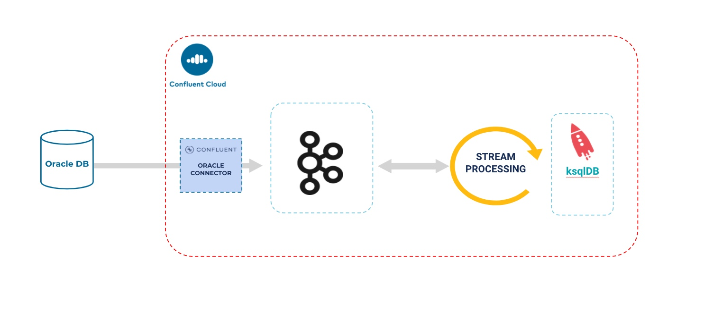
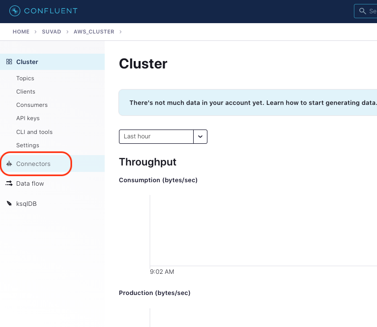
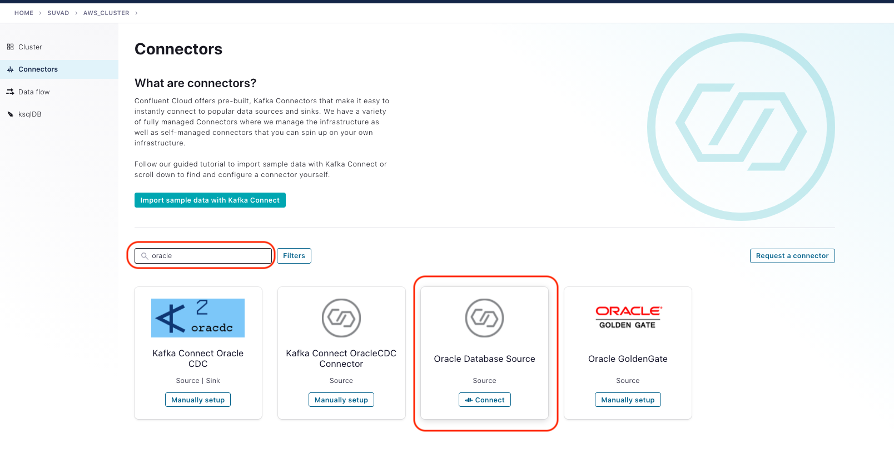
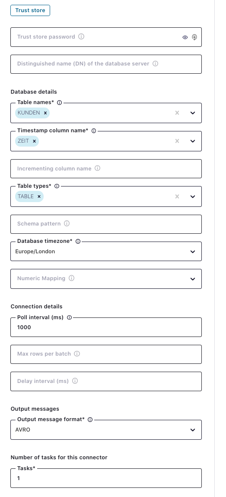
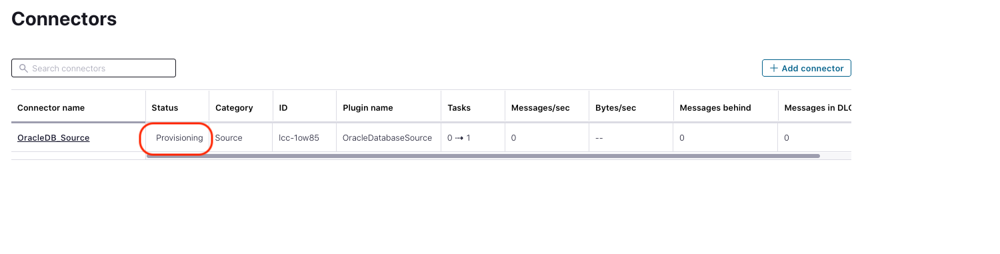
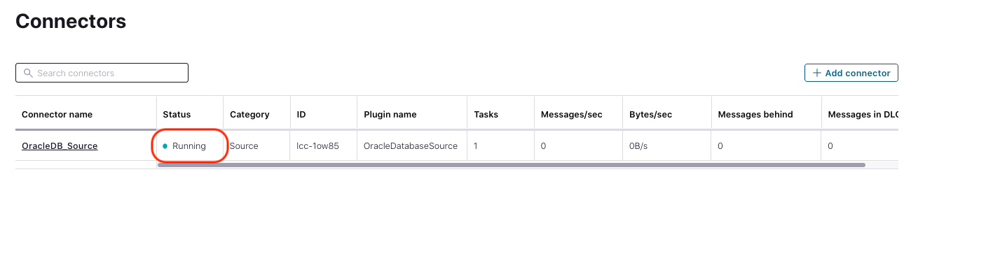
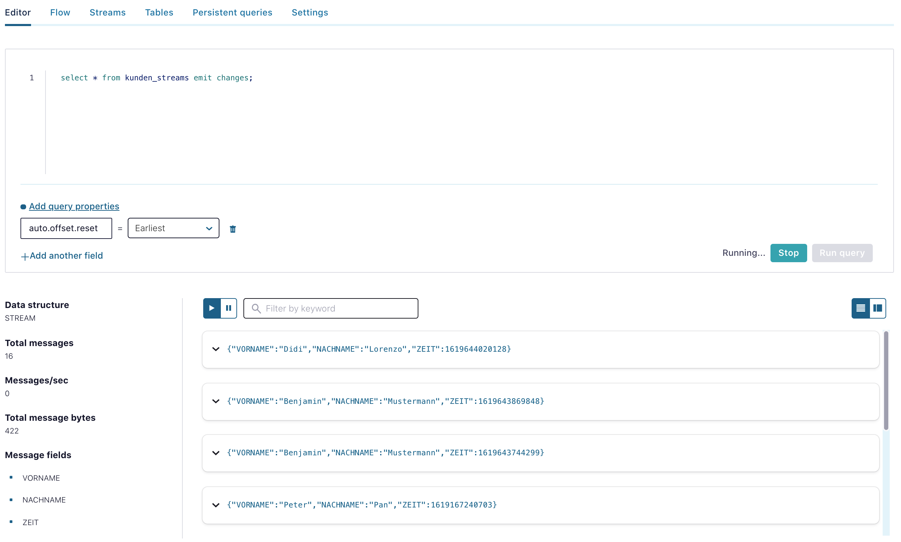

# Connect Oracle DB 12.2 with fully-managed Connector (ready with Confluent Cloud)
We prepared a running DB 12.2 from Oracle with deployed data model including data.
The task is know to create a fully-managed Connector and load data from Oracle DB into Kafka Cluster.



We will use the fully-managed Oracle DB Source Connector in Confluent Cloud.
You can setup the connector with GUI or `ccloud cli`.
In this case we will create connector with the GUI.
The cli would looks like this: 
```bash
ccloud connector create --cluster YOUR-cluster-id --config oracle.properties
```
-----
In the first step click on the left side on Connectors (see pic below)



Type in the search field "oracle" and choose the "Oracle Database Source" Source Connector



Now type in the db connection details (see pic below). Please use exactly the same lower and upper case like in the pic.




Click on next and then on "Launch".


The conenctor will be provisioned.


After few minutes the status is then "Running"


Now, take a look into Topic list if you can see the new generated topic oracledb.KUNDEN and if yes, go to tab messages and start from 0 offset and you should see the events are coming from Oracle DB.

To take this new Oracle DB data stream in our event processing we have to transform the topic into a real stream. Please go to ksqlDB Editor and create a topic:
```bash
ksql> create stream kunden_streams with (kafka_topic='oracledb.KUNDEN', value_format='avro');
```                                    
As you can see we do not to define columns here. This is because everything is described within the schema of the topic. The stream will take the data describtion from the schema.
Now, set the offset to earlist and select your new stream:


End lab11

[go back to Agenda](https://github.com/ora0600/confluent-ksqldb-hands-on-workshop/blob/master/README.md#hands-on-agenda-and-labs)

